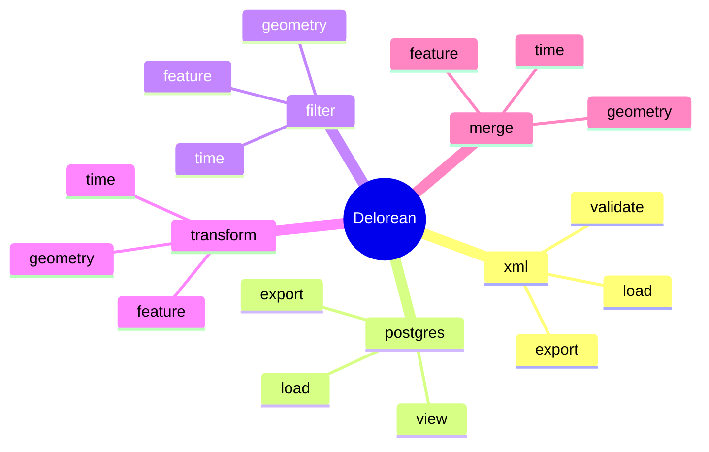

```
 ██████╗ ███████╗██╗      ██████╗ ██████╗ ███████╗ █████╗ ███╗   ██╗         █████╗ ██╗██╗  ██╗███╗   ███╗ 
 ██╔══██╗██╔════╝██║     ██╔═══██╗██╔══██╗██╔════╝██╔══██╗████╗  ██║        ██╔══██╗██║╚██╗██╔╝████╗ ████║ 
 ██║  ██║█████╗  ██║     ██║   ██║██████╔╝█████╗  ███████║██╔██╗ ██║ █████╗ ███████║██║ ╚███╔╝ ██╔████╔██║ 
 ██║  ██║██╔══╝  ██║     ██║   ██║██╔══██╗██╔══╝  ██╔══██║██║╚██╗██║ ╚════╝ ██╔══██║██║ ██╔██╗ ██║╚██╔╝██║ 
 ██████╔╝███████╗███████╗╚██████╔╝██║  ██║███████╗██║  ██║██║ ╚████║        ██║  ██║██║██╔╝ ██╗██║ ╚═╝ ██║ 
 ╚═════╝ ╚══════╝╚══════╝ ╚═════╝ ╚═╝  ╚═╝╚══════╝╚═╝  ╚═╝╚═╝  ╚═══╝        ╚═╝  ╚═╝╚═╝╚═╝  ╚═╝╚═╝     ╚═╝ 

```                      

Deloreans - AIXM :  A complete toolkit for managing AIXM aeronautical data.
Deloreans is an open-source tool written in Java and targeted at PostgreSQL, allowing users to create, visualize, and work with AIXM datasets. Delorean acts as a link between XML, PostgreSQL and QGIS. 



Delorean support all features types found in aixm for the following aixm versions : 
* [x] 5_2
* [x] 5_1_1
* [x] 5_1
* [ ] 5_0
* [ ] 4_5 

## License

Delorean is licensed under the GPLV3

## Using

Consult the Wiki : [Usage](https://github.com/3l-gee/delorean/wiki) / [Exemple](https://github.com/3l-gee/delorean/wiki/Use-case-Exemple)

## Building

The build process for Delorean can be divided into two categories: schema compilation and incremental builds.

### Building

For most changes, such as bug fixes or feature updates, you can directly build the project using:
```bash
mvn package
```

This is the fastest and most common build process, as it does not involve regenerating the AIXM-specific codebase.

#### Schema Generation
Schema generation is required when there are changes to the AIXM XSD schema. This process is more resource-intensive and generates the entire AIXM-specific codebase. To perform schema generation, run the following commands:
```bash
mvn clean install -P enable-hyper-jaxb
mvn install package
```

This step involves manual modifications to the generated classes due to limitations in the JAXB tool suite. After schema generation, inspect the generated code and apply necessary adjustments to ensure compatibility with the AIXM schema and project requirements. Document any changes for future reference.

## Documentation
Please refer to the [wiki](https://github.com/3l-gee/delorean/wiki) for the full documentation.

## Bugs

TODO

## Community support

TODO

## Contributing

TODO

