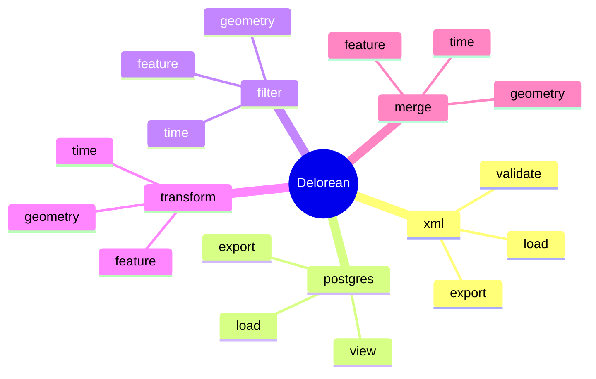

```
 ██████╗ ███████╗██╗      ██████╗ ██████╗ ███████╗ █████╗ ███╗   ██╗         █████╗ ██╗██╗  ██╗███╗   ███╗ 
 ██╔══██╗██╔════╝██║     ██╔═══██╗██╔══██╗██╔════╝██╔══██╗████╗  ██║        ██╔══██╗██║╚██╗██╔╝████╗ ████║ 
 ██║  ██║█████╗  ██║     ██║   ██║██████╔╝█████╗  ███████║██╔██╗ ██║ █████╗ ███████║██║ ╚███╔╝ ██╔████╔██║ 
 ██║  ██║██╔══╝  ██║     ██║   ██║██╔══██╗██╔══╝  ██╔══██║██║╚██╗██║ ╚════╝ ██╔══██║██║ ██╔██╗ ██║╚██╔╝██║ 
 ██████╔╝███████╗███████╗╚██████╔╝██║  ██║███████╗██║  ██║██║ ╚████║        ██║  ██║██║██╔╝ ██╗██║ ╚═╝ ██║ 
 ╚═════╝ ╚══════╝╚══════╝ ╚═════╝ ╚═╝  ╚═╝╚══════╝╚═╝  ╚═╝╚═╝  ╚═══╝        ╚═╝  ╚═╝╚═╝╚═╝  ╚═╝╚═╝     ╚═╝ 

```                      

Deloreans is an open-source tool written in Java and targeted at PostgreSQL, allowing users to create, visualize, and work with AIXM datasets. Delorean acts as a link between XML, PostgreSQL and QGIS. 



Delorean support all features types found in aixm for the following aixm versions : 
* [x] 5_2
* [x] 5_1_1
* [x] 5_1
* [ ] 5_0
* [ ] 4_5 

## License

Delorean is licensed under the MIT License.

## Using

Consult the Wiki : [Usage](https://github.com/3l-gee/delorean/wiki) / [Exemple](https://github.com/3l-gee/delorean/wiki/Use-case-Exemple)

## Building

The build process for delorean is complicated as it relies on the aixm xsd to build the entire aixm specific code base. 
✨ Deloreans Rube goldberg build machine ✨
1) ```mvn clean install -P enable-hyper-jaxb```
5) ```mvn install package```

Additionally, the ressources produced for QGIS and postgresql rely on codegeneration like toolkits custum made for the purpose of Delorean.

## Documentation
Please refer to the [wiki](https://github.com/3l-gee/delorean/wiki) for the full documentation.

## Bugs

TODO

## Community support

TODO

## Contributing

TODO

