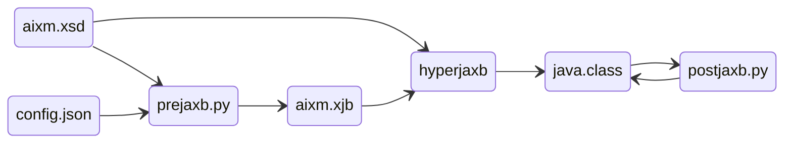
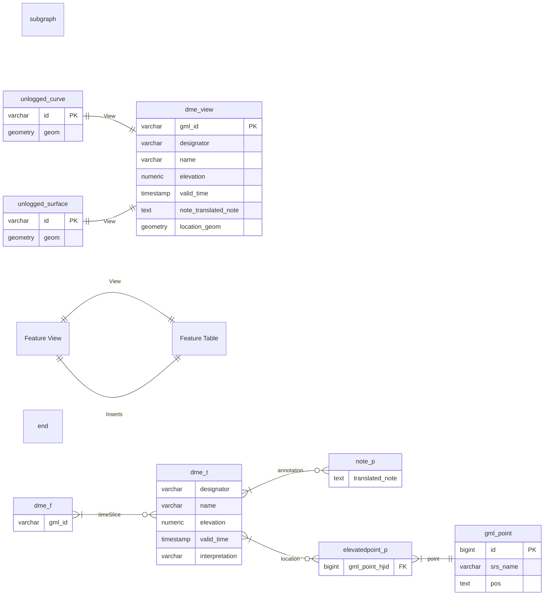
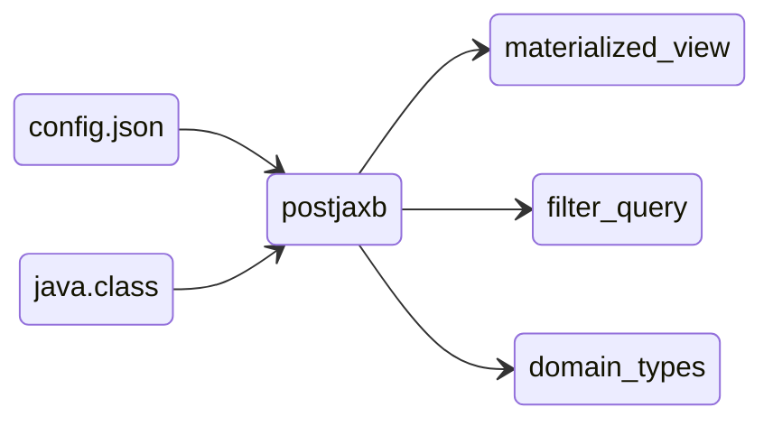

# Concepts

The Aeronautical Information Exchange Model (AIXM) is the global standard for representing and sharing digital aeronautical information. Administered jointly by Eurocontrol and the FAA, the AIXM standard defines how the aviation industry digitises all aspects of airspace, including airspaces, airports, runways, navigation aids, flight obstacles, routes and waypoints.

Software supporting a given data schema is typically required to solve three core problems:

- Ingest data from that schema
- Read and query that schema
- Write or produce that schema

Unlike static mapping or generic GIS formats, any software claiming true AIXM compliance cannot simply treat AIXM as flat spatial data. It must natively support and enforce three domain-specific aeronautical concepts:

- Temporality through versions and corrections
- Types of messages (BASELINE, TEMPDELTAS, DELTAS, SNAPSHOTS)
- Advanced Geometry Capabilities

Furthermore, the AIXM schema itself poses unusual challenges due to its size, deeply nested structure and polymorphic nature. To address these challenges, the Delorean AIXM project required a technology stack that offered flexibility, capability and robustness. The three core aspects of Delorean-AIXM are:

- Java 21
    - Schema-driven code generation: Standard JAXB/Jakarta XML Binding tools compile XML Schema Definitions (XSD) into strongly-typed Java domain classes.
    - Marshalling: Strict round-trip fidelity when unmarshalling raw XML messages
- PostgreSQL + PostGIS
    - Relational database : If you're not using PostgreSQL, you're either a bank or wrong.
    - Geospatial rocessing: PostGIS provides all the tools required for advanced geometry rendering.
- Hibernate (JPA)
    - Nested ORM: Maps Java class hierarchies, polymorphic entities, and nested object graphs to relational database tables.
    - Schema Generation: Derives the target relational database schema (tables, foreign key constraints, join tables, sequences) directly from annotated Java domain classes.

All of these products were then incorporated into the core concepts of the Delorean-AIXM solution.

## Automated HyperJAXB-generated class

Delorean-AIXM relies on automatically generated domain classes annotated for both JAXB XML serialization and JPA/Hibernate database persistence. Delorean uses an automated code generation pipeline that transforms raw XML Schemas directly into AIXM-compliant Java XML Bindings and 3NF-compliant PostGIS database model.

This is achieved by taking the official XML schema definition files `aixm.xsd` published by Eurocontrol and the FAA, along with a `config.json` file that steers the class generation rules. These inputs are fed into `prejaxb.py`, a utility script that produces an `aixm.xjb` binding file to customize and extend the original XSD schemas.

`hyperjaxb` then compiles the schemas and binding rules into `java.class` annotated for both XML streaming (JAXB) and database persistence (JPA/Hibernate). Finally, `postjaxb.py` performs a second pass on the generated `java.class`, modifying addapted types, naming and fix structural limitations inherent to `hyperjaxb`.

As the generated classes are derived directly from the original `aixm.xsd`, the structure of the classes and the database schema are very similar to the original `aixm.xsd`.

The root class, AIXM Message, holds all the metadata and AIXM features. Each AIXM feature contains  AIXM Timeslices, which contains attributes and AIXM objects. All of these classes also retain their correct GML inheritance all the way to GMLType, as AIXM is built on top of GML concepts. 

As the generated classes are derived directly from the original `aixm.xsd`, the structure of the classes and the database schema are very similar to the original `aixm.xsd`.

The database is divided into 17 schemas reflecting standard AIXM feature packages (e.g., Aerial Refuelling, AirportHeliport). Additionally, three specialized schemas are included:

- `public`: Contains abstractc concepts.
- `gml`: Handles geometries (replacing AIXM's native Geometry structures).
- `aixm`: Manages abstract AIXM core types such as messages and metadata.

The database follows the same (but shortened) naming strategy as AIXM :

| Suffix | AIXM Type | Exemple Class | Exemple Database | 
| ------ | --------- | ------------- | ---------------- |
| `_f` | (Feature)Type | DMEType | `dme_f` |
| `_tp` | (Feature)TimeSlicePropertyType | DMETimeSlicePropertyType | `dme_tp` |
| `_t` | (Feature)TimeSliceTypee | DMETimeSliceTypee | `dme_t` |
| `_te` | (Feature)TimeSliceExtensionType | DMETimeSliceExtensionType | `dme_te` |
| `_p` | (Feature)PropertyType | DMEPropertyType | `dme_p` |
| `_p` | (Property)PropertyType | NotePropertyType | `note_p` |
| `_o` | (Object)Type | NoteType | `note_o` |
| `_oe` | (Object)ExtensionType | NoteExtensionType | `note_oe` |

Association between table follow three standadized paterns : 

| Relation | Type | Naming Pattern | Exemple |
| -------- | ---- | -------------- | ------- |
| One-to-One | Embedded | (Attribute)_(Nested Attribute) | `designator_nilreason`|
| One-to-One | Join Columns | (Table)_hjid | `dme_te_hjid`|
| One-to-One | Join Table | (Table)_(Role)_link | `dmetmslctp_lctn_link`|

The links between features are materialised either through join columns (one-to-many) or join tables.

Overall, this means that Delorean-AIXM has only one automatically generated layer between the database and the XML files. This ensures that the class and database structures remain robust and flexible in the face of future changes and extensions while keeping the middle layer lean and efficient for effective parsing and persistence in all the other required workflows.

## Swift write-render-read operation

To abstract away the complex, deeply nested table structure of AIXM and eliminate the performance penalty of querying 8–10 levels of joins at runtime, Delorean-AIXM relies on Materialized Views. These materialized views flatten the normalized 3NF AIXM schema into clean, tabular representations of aeronautical features while automatically resolving spatial, relational, and temporal logic directly inside PostgreSQL. This is the key reason why the AIXM schema can be connected to standard GIS tool, the performance of querying these materialised views is sub-millisecond.

The unlogged table for curve and surface geometries enables the GML geometries to be rendered in parallel, since multiple sessions can write to the unlogged table simultaneously, thereby speeding up the rendering process.

These view a generated by taking the same `config.json` we used for the java class generation, `java.class` generation themselves and are pipes into a utility called `prejaxb`. 

As mentioned above, the GML AIXM geometries are computed in the database. First, PostGIS computes the complex segments (arcs, circles and geodesics) from the GML primitives (points, lines and polygons), which are then merged to form curves. These curves then serve as the geometric basis for the views and surfaces. In a second phase, PostGIS computes the surface rings by aggregating, cutting, merging and ordering the previously generated curves. These rings are then merged into polygons to form surfaces.

Why use an unlogged table rather than a view for this? A view (materialised or not) can only be used by one session at a time. This means that all the geometry and intermediate results must be computed and held in memory by a single session. This significantly slows down the computation, even on a high-end, optimised PostgreSQL server, because the memory allocation per session is almost always reached. By using an unlogged table and multiple sessions, we can divide the memory footprint and increase the number of parallel jobs. However, the number of sessions should match the number of cores available to the database, as having too many sessions would be counterproductive. 

This multiple-session pattern is used by all functions that interact with PostgreSQL from Delorean-AIXM from persist, extract, merge, predicate etc.