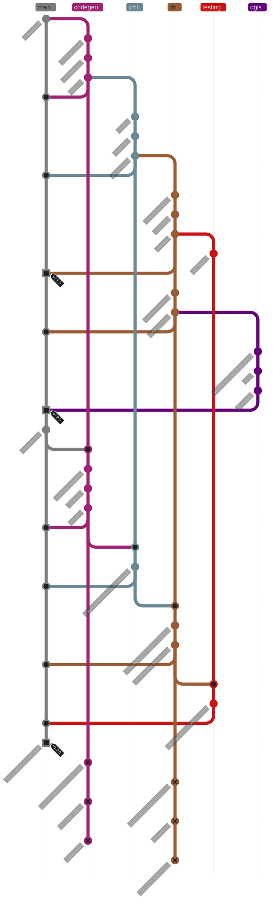

# Roadmap

This Git graph shows the milestones achieved and planned for the Delorean project. 

```mermaid
%%{init: { 'theme': 'dark'}}%%
gitGraph TB:
    commit id: "Delorean init"
    branch codegen
    commit id: "JAXB generation"
    commit id: "XJB generation"
    commit id: "AIXM 5.1"
    checkout main
    merge codegen
    checkout codegen
    branch xml
    commit id: "adapters"
    commit id: "marshalling"
    commit id: "unmarshalling"
    checkout main
    merge xml
    checkout xml
    branch db
    commit id: "schema generation"
    commit id: "persistence"
    commit id: "extraction"
    branch testing
    commit id: "test data set"
    checkout main
    merge db type: HIGHLIGHT tag: "v0.1.0"
    checkout db
    commit id: "geometry rendering"
    commit id: "view generation"
    checkout main
    merge db
    checkout db
    branch qgis
    commit id: "visualisation project generation"
    commit id: "action"
    commit id: "html widget"
    checkout main
    merge qgis type: HIGHLIGHT tag: "v0.2.0"
    checkout main
    commit id: "modularisation"
    checkout codegen
    merge main
    commit id: "Hyperjaxb generation"
    commit id: "AIXM 5.1.1"
    commit id: "AIXM 5.2"
    checkout main
    merge codegen
    checkout xml
    merge codegen
    commit id: "Rigorous namespace, nil, nil reason"
    checkout main
    merge xml
    checkout db
    merge xml
    commit id: "AIXM types as PostgreSQL domain"
    commit id: "Multithreaded inserst, reads"
    checkout main
    merge db
    checkout testing
    merge db
    commit id: "Containerised automated testing"
    checkout main
    merge testing
    commit id: "Cli, workflow and sdk toolkit" type: HIGHLIGHT tag: "v1.0.0"
    checkout codegen
    commit id: "validation & buisiness rules (java)" type:REVERSE
    checkout db
    commit id: "validation & buisiness rules (db)" type:REVERSE
    checkout codegen
    commit id: "extended schema" type:REVERSE
    checkout db
    commit id: "create & edit" type:REVERSE
    checkout codegen
    commit id: "digital notam" type:REVERSE
    checkout db
    commit id: "temp delta & perm delta" type:REVERSE
    checkout main
```